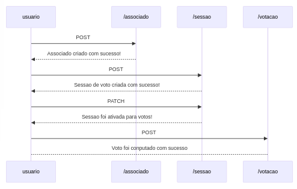

# Aplicação de votação

Para inicar aplicação via docker basta seguir os passos abaixo:

1. Executar build: ``sudo docker build -t <nome-da-imagem> .``
2. Iniciar o container: ``sudo docker run -p 8080:8080 -p 9090:9090 <nome-da-imagem>``

Segue abaixo a sequencia correta:



1. criar associado
2. Criar sessao/pauta
3. iniciar votacao
4. associado votar
5. Contabilizar votos


### Fluxo correto

1. Criar associado
```shell
curl -X POST -H "Content-Type: application/json" -d '{
  "cpf": "98765432109"
}' http://localhost:8080/associado
```

2. Criando a sessao de votacao/pauta

```shell
curl -X POST -H "Content-Type: application/json" -d '{
  "tempoDaVotacao": "08:00:00",
  "votacaoEmAndamento": false,
  "inicioDaContagem": null,
  "fimDaContagem": null,
  "formulario": {
    "votos": [],
    "idAssociadosQueVotaram": []
  },
  "pauta": {
    "titulo": "Pauta sobre vacinas",
    "descricao": "vacinacao de bebes"
  }
}' http://localhost:8080/sessao
```

3. Iniciar sessao para votos

```shell
curl -X PATCH -H "Content-Type: application/json" -d '{
  "id": 1,
  "votacaoEmAndamento": true
}' http://localhost:8080/sessao/
```

4. Computar voto na sessao

```shell
curl -X POST -H "Content-Type: application/json" -d '{
  "cpf": "98765432109",
  "voto": "SIM",
  "idSessao": 1
}' http://localhost:8080/votacao
```

5. Contabilizar votos da sessao

```shell
curl -X GET -H "Content-Type: application/json" -d '{
}' http://localhost:8080/votacao/total/1
```